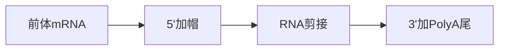
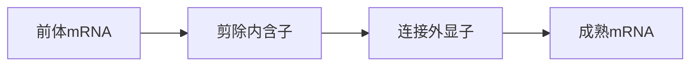

# 分子生物学综合测试卷答案与解析

# 第一部分 转录、翻译章节选择题

## 1. 原核生物RNA聚合酶全酶中，参与识别转录起始信号的因子是（）。

A. α  
B. β  
C. β'  
D. σ

<details>
<summary>查看答案与解析</summary>

**答案：D**

**解析：** σ因子负责识别启动子（-10区和-35区），引导RNA聚合酶准确结合到转录起始位点。

</details>

---

## 2. 核糖体的A位点是（）。

A. 真核mRNA加工位点  
B. tRNA离开原核生物核糖体的位点  
C. 新到来的AA-tRNA进入的位点  
D. 起始AA-tRNA结合的位点

<details>
<summary>查看答案与解析</summary>

**答案：C**

**解析：**

A位（Aminoacyl site）是氨酰-tRNA进入位点。

### 核糖体三个位点

| 位点 | 英文 | 作用 |
|------|------|------|
| A位 | Aminoacyl site | 新tRNA进入 |
| P位 | Peptidyl site | 持有肽链 |
| E位 | Exit site | tRNA离开 |

速记：

> A位进，P位连，E位出

</details>

---

## 3. 蛋白质的生物合成方向是（）

A. 从C端→N端  
B. 定点双向进行  
C. 从N端、C端同时进行  
D. 从N端→C端

<details>
<summary>查看答案与解析</summary>

**答案：D**

**解析：**

翻译过程中新的氨基酸不断加到肽链羧基端（C端），因此肽链延长方向始终为：

```text
N端 → C端
```

</details>

---

## 4. 真核生物mRNA的转录加工不包括（）

A. 切除内含子，连接外显子  
B. 5'加帽子结构  
C. 3'端加多聚腺苷酸尾巴  
D. 加CCA-OH

<details>
<summary>查看答案与解析</summary>

**答案：D**

**解析：**

成熟真核mRNA加工包括：



CCA-OH加在tRNA的3'端，不属于mRNA加工。

</details>

---

## 5. 下列关于DNA复制与转录过程的描述，其中错误的是（）

A. 体内只有模板链转录，而两条DNA链都能复制  
B. 在两个过程中，新链合成方向均为5'→3'  
C. 在两个过程中，新链合成均需要RNA引物  
D. 在两个过程中，所需原料不同，催化酶也不同

<details>
<summary>查看答案与解析</summary>

**答案：C**

**解析：**

| 项目 | DNA复制 | 转录 |
|--------|--------|--------|
| 是否需要引物 | 需要 | 不需要 |
| 催化酶 | DNA聚合酶 | RNA聚合酶 |
| 原料 | dNTP | NTP |

RNA聚合酶能够自行起始，因此转录不需要引物。

</details>

---

## 6. 真核生物mRNA的转录加工不包括（）

A. 切除内含子，连接外显子  
B. 5'加帽子结构  
C. 3'端加多聚腺苷酸尾巴  
D. 加CCA-OH

<details>
<summary>查看答案与解析</summary>

**答案：D**

**解析：**

同第4题。

</details>

---

## 7. 真核生物RNA聚合酶Ⅰ催化生成的产物有（）

A. mRNA  
B. tRNA  
C. 5S rRNA  
D. 5.8S rRNA

<details>
<summary>查看答案与解析</summary>

**答案：D**

**解析：**

### 真核RNA聚合酶比较

| RNA聚合酶 | 转录产物 |
|-----------|----------|
| RNA Pol I | 28S、18S、5.8S rRNA |
| RNA Pol II | mRNA |
| RNA Pol III | tRNA、5S rRNA |

记忆口诀：

> I做大rRNA  
> II做mRNA  
> III做tRNA和5S

</details>

---

## 8. 真核生物中，编码蛋白质的基因通常是由哪种RNA聚合酶转录的（）

A. RNA聚合酶Ⅰ  
B. RNA聚合酶Ⅱ  
C. RNA聚合酶Ⅲ  
D. RNA聚合酶Ⅳ

<details>
<summary>查看答案与解析</summary>

**答案：B**

**解析：**

编码蛋白质的基因转录产生mRNA，而mRNA由RNA聚合酶Ⅱ负责合成。

</details>

---

## 9. 一个tRNA的反密码子是5'-CAU-3'，它识别的密码子为（）

A. 5'-GUA-3'  
B. 5'-ATG-3'  
C. 5'-AUG-3'  
D. 5'-GTA-3'

<details>
<summary>查看答案与解析</summary>

**答案：C**

**解析：**

反密码子与密码子反向互补配对：

```text
反密码子：5'-CAU-3'

配对方向：

3'-UAC-5'

密码子：

5'-AUG-3'
```

AUG同时也是起始密码子。

</details>

---

## 10. 下列物质不是细菌核糖体的组成成分的是（）。

A.16S rRNA  
B.23S rRNA  
C.5.8S rRNA  
D.5S rRNA

<details>
<summary>查看答案与解析</summary>

**答案：C**

**解析：**

### 原核核糖体

```text
30S：
16S rRNA

50S：
23S rRNA
5S rRNA
```

5.8S rRNA是真核核糖体特有成分。

</details>

---

## 11. 蛋白质合成过程中氨基酸的活化是由下列哪种物质提供能量（）

A. ATP  
B. GTP  
C. CTP  
D. UTP

<details>
<summary>查看答案与解析</summary>

**答案：A**

**解析：**

氨基酸活化反应：

```text
氨基酸 + tRNA + ATP
↓
AA-tRNA
```

催化酶：

氨酰-tRNA合成酶。

</details>

---

## 12. 成熟的真核生物mRNA的5'端具有（）

A. Poly(A)  
B. Poly(B)  
C. Poly(T)  
D. 帽子结构

<details>
<summary>查看答案与解析</summary>

**答案：D**

**解析：**

成熟mRNA：

```text
5' m7G帽
↓
编码区
↓
Poly(A)尾
3'
```

帽子结构有助于：

- 防止降解
- 核输出
- 翻译起始

</details>

---

## 13. 真核生物mRNA帽子结构与mRNA初始产物的第一个核苷酸是通过如下何种方式连接（）

A.5'-5'二磷酸连接  
B.5'-5'三磷酸连接  
C.3'-5'二磷酸连接  
D.3'-5'三磷酸连接

<details>
<summary>查看答案与解析</summary>

**答案：B**

**解析：**

帽子结构的核心特征：

```text
m7GpppN
```

即：

5'-5'三磷酸键连接。

</details>

---

## 14. 某些氨基酸有几个密码子同时编码，这种现象称为（）

A. 密码子的方向性  
B. 密码子的连续性  
C. 密码子的通用性  
D. 密码子的简并性

<details>
<summary>查看答案与解析</summary>

**答案：D**

**解析：**

例如：

```text
Leu：
UUA
UUG
CUU
CUC
CUA
CUG
```

多个密码子对应同一种氨基酸称为密码子简并性。

</details>

---

## 15. 在蛋白质合成过程中，tRNA通过下列哪个结构区域携带氨基酸进入核糖体中（）。

A.5'端  
B.3'端  
C.反密码环  
D.二氢尿嘧啶环

<details>
<summary>查看答案与解析</summary>

**答案：B**

**解析：**

tRNA末端结构：

```text
3'-CCA-OH
```

氨基酸连接在A末端。

</details>

---

## 16. 关于内含子的叙述，哪一条是正确的（）。

A.通过DNA重组被去掉  
B.通过RNA剪切被去掉  
C.在翻译过程中被核糖体滑过而避免翻译  
D.所指导合成的多肽序列在翻译后被切除

<details>
<summary>查看答案与解析</summary>

**答案：B**

**解析：**

内含子在前体mRNA加工阶段被剪除。



</details>

---

# 第二部分 转录、翻译章节判断题

## 1. 肽链从核糖体P位的肽酰-tRNA转移至A位的氨酰-tRNA，导致肽链延伸。（）

<details>
<summary>查看答案与解析</summary>

**答案：√**

**解析：**

肽酰转移酶催化形成肽键，肽链由P位转移至A位。

</details>

---

## 2. 转录过程中RNA聚合酶需要引物。（）

<details>
<summary>查看答案与解析</summary>

**答案：×**

**解析：**

RNA聚合酶可直接开始合成RNA，不需要引物。

</details>

---

## 3. 真核生物的RNA聚合酶不能直接识别启动子，需要转录因子帮助。（）

<details>
<summary>查看答案与解析</summary>

**答案：√**

**解析：**

真核转录必须依赖通用转录因子（TFIID、TFIIB等）组装起始复合体。

</details>

---

## 4. 原核生物的mRNA通常是单顺反子，并且通常是边转录边翻译。（）

<details>
<summary>查看答案与解析</summary>

**答案：×**

**解析：**

原核生物多数为多顺反子mRNA，但确实存在边转录边翻译现象。

</details>

---

## 5. 核酶主要是指细胞核中的酶类。（）

<details>
<summary>查看答案与解析</summary>

**答案：×**

**解析：**

核酶（Ribozyme）是具有催化活性的RNA。

</details>

---

## 高频易错点速记

<details>
<summary>点击展开速记总结</summary>

1. σ因子识别启动子

2. A位进、P位连、E位出

3. 翻译方向：N端→C端

4. 复制需要引物，转录不要引物

5. RNA PolⅠ → 18S、5.8S、28S rRNA

6. RNA PolⅡ → mRNA

7. RNA PolⅢ → tRNA、5S rRNA

8. 真核起始氨基酸Met，原核fMet

9. DNA PolⅠ切引物，DNA PolⅢ负责复制

10. 核小体核心DNA = 146 bp

11. B-DNA最常见

12. 半保留复制 = 一旧一新

13. UAA/UAG/UGA是终止密码子

14. AUG是起始密码子

15. CCA末端携带氨基酸，反密码环识别密码子

</details>
