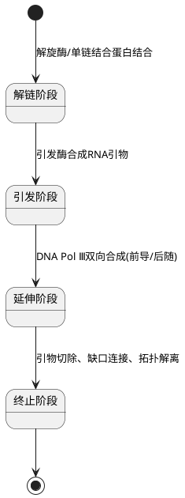

# 分子生物学综合测试卷

---

## 🧬 第一部分 转录、翻译章节选择题

### 1. 原核生物RNA聚合酶全酶中，参与识别转录起始信号的因子是（）。
A. α &nbsp;&nbsp;&nbsp;&nbsp; B. β &nbsp;&nbsp;&nbsp;&nbsp; C. β' &nbsp;&nbsp;&nbsp;&nbsp; D. σ

<details>
<summary>💡 点击显示答案与解析</summary>

**【答案】** D  
**【解析】** * **核心知识点**：原核生物的 RNA 聚合酶全酶（$\alpha_2\beta\beta'\sigma$）中，**$\sigma$ 因子**专门负责特异性识别启动子（-10 区和 -35 区）并引导全酶结合。核心酶（$\alpha_2\beta\beta'$）则负责链的延伸。
</details>

---

### 2. 核糖体的A位点是（）。
A. 真核mRNA加工位点 &nbsp;&nbsp;&nbsp;&nbsp; B. tRNA离开原核生物核糖体的位点  
C. 新到来的AA-tRNA进入的位点 &nbsp;&nbsp;&nbsp;&nbsp; D. 起始AA-tRNA结合的位点

<details>
<summary>💡 点击显示答案与解析</summary>

**【答案】** C  
**【解析】** * **核心知识点**：核糖体拥有三个经典的 tRNA 结合位点：**A位（Aminoacyl site，氨酰位）**是新到来的氨酰-tRNA（AA-tRNA）进入的位点；**P位（Peptidyl site，肽酰位）**结合正在延长的肽酰-tRNA；**E位（Exit site，排出位）**则是去酰基的 tRNA 离开核糖体的位点。
</details>

---

### 3. 蛋白质的生物合成方向是（）
A. 从C端→N端 &nbsp;&nbsp;&nbsp;&nbsp; B. 定点双向进行 &nbsp;&nbsp;&nbsp;&nbsp; C. 从N端、C端同时进行 &nbsp;&nbsp;&nbsp;&nbsp; D. 从N端→C端

<details>
<summary>💡 点击显示答案与解析</summary>

**【答案】** D  
**【解析】** * **核心知识点**：无论是原核还是真核生物，翻译时核糖体沿着 mRNA 的 $5' \rightarrow 3'$ 方向移动，而新生肽链的合成方向一律为**从 N端 $\rightarrow$ C端**。
</details>

---

### 4. 真核生物mRNA的转录加工不包括（）
A. 切除内含子，连接外显子 &nbsp;&nbsp;&nbsp;&nbsp; B. 5'加帽子结构 &nbsp;&nbsp;&nbsp;&nbsp; C. 3'端加多聚腺苷酸尾巴 &nbsp;&nbsp;&nbsp;&nbsp; D. 加CCA-OH

<details>
<summary>💡 点击显示答案与解析</summary>

**【答案】** D  
**【解析】** * **核心知识点**：真核生物 mRNA 的成熟加工包括 5'加帽子结构（$m^7G$）、3'加 Poly(A) 尾以及切除内含子并连接外显子。而 **3'端加 CCA-OH 是 tRNA 的特异性加工修饰**，用于连接氨基酸。
</details>

---

### 5. 下列关于DNA复制与转录过程的描述，其中错误的是（）
A. 体内只有模板链转录，而两条DNA链都能复制  
B. 在两个过程中，新链合成方向均为5'→3'  
C. 在两个过程中，新链合成均需要RNA引物  
D. 在两个过程中，所需原料不同，催化酶也不同

<details>
<summary>💡 点击显示答案与解析</summary>

**【答案】** C  
**【解析】** * **核心知识点**：**转录不需要引物**，RNA 聚合酶可以直接在单链 DNA 模板上催化游离三磷酸核苷（NTP）聚合；而 **DNA 复制必需由引发酶合成一段 RNA 引物**提供自由的 $3'-OH$，DNA 聚合酶才能延伸链。
</details>

---

### 6. 真核生物RNA聚合酶Ⅰ催化生成的产物有（）
A. mRNA &nbsp;&nbsp;&nbsp;&nbsp; B. tRNA &nbsp;&nbsp;&nbsp;&nbsp; C. 5S rRNA &nbsp;&nbsp;&nbsp;&nbsp; D. 5.8S rRNA

<details>
<summary>💡 点击显示答案与解析</summary>

**【答案】** D  
**【解析】** * **核心知识点**：真核生物三种主要 RNA 聚合酶的分工：
  * **RNA Pol Ⅰ**：转录核仁区基因，产物为 **28S、18S、5.8S rRNA**。
  * **RNA Pol Ⅱ**：转录编码蛋白质的基因，产物为 **mRNA**。
  * **RNA Pol Ⅲ**：转录短小核酸，产物为 **tRNA、5S rRNA** 等。
</details>

---

### 7. 真核生物中，编码蛋白质的基因通常是由哪种RNA聚合酶转录的（）
A. RNA聚合酶Ⅰ &nbsp;&nbsp;&nbsp;&nbsp; B. RNA聚合酶Ⅱ &nbsp;&nbsp;&nbsp;&nbsp; C. RNA聚合酶Ⅲ &nbsp;&nbsp;&nbsp;&nbsp; D. RNA聚合酶Ⅳ

<details>
<summary>💡 点击显示答案与解析</summary>

**【答案】** B  
**【解析】** * **核心知识点**：同上题，真核生物中产生 mRNA（蛋白质合成的直接模板）的全部由 **RNA 聚合酶Ⅱ** 催化。
</details>

---

### 8. 一个tRNA的反密码子是5'-CAU-3'，它识别的密码子为（）
A. 5'-GUA-3' &nbsp;&nbsp;&nbsp;&nbsp; B. 5'-ATG-3' &nbsp;&nbsp;&nbsp;&nbsp; C. 5'-AUG-3' &nbsp;&nbsp;&nbsp;&nbsp; D. 5'-GTA-3'

<details>
<summary>💡 点击显示答案与解析</summary>

**【答案】** C  
**【解析】** * **核心知识点**：密码子（mRNA）与反密码子（tRNA）之间为**反向平行且碱基互补配对**。
  * 反密码子：$5'-C-A-U-3'$
  * 互补配对：$3'-G-U-A-5'$
  * 写成标准的 $5' \rightarrow 3'$ 方向即为：**$5'-A-U-G-3'$**。
</details>

---

### 9. 下列物质不是细菌核糖体的组成成分的是（）。
A. 16S rRNA &nbsp;&nbsp;&nbsp;&nbsp; B. 23S rRNA &nbsp;&nbsp;&nbsp;&nbsp; C. 5.8S rRNA &nbsp;&nbsp;&nbsp;&nbsp; D. 5S rRNA

<details>
<summary>💡 点击显示答案与解析</summary>

**【答案】** C  
**【解析】** * **核心知识点**：**原核（细菌）核糖体（70S）**由 50S大亚基（含 23S 和 5S rRNA）和 30S小亚基（含 16S rRNA）组成。而 **5.8S rRNA** 是真核生物核糖体大亚基（60S）的特有成分。
</details>

---

### 10. 蛋白质合成过程中氨基酸的活化是由下列哪种物质提供能量（）
A. ATP &nbsp;&nbsp;&nbsp;&nbsp; B. GTP &nbsp;&nbsp;&nbsp;&nbsp; C. CTP &nbsp;&nbsp;&nbsp;&nbsp; D. UTP

<details>
<summary>💡 点击显示答案与解析</summary>

**【答案】** A  
**【解析】** * **核心知识点**：氨基酸在氨酰-tRNA合成酶的催化下，**消耗 ATP** 活化形成氨酰-AMP 中间体，随后再与 tRNA 结合。注意：后续在翻译延伸阶段（如进位和移位）消耗的则是 **GTP**。
</details>

---

### 11. 成熟的真核生物mRNA的5'端具有（）
A. Poly(A) &nbsp;&nbsp;&nbsp;&nbsp; B. Poly(B) &nbsp;&nbsp;&nbsp;&nbsp; C. Poly(T) &nbsp;&nbsp;&nbsp;&nbsp; D. 帽子结构

<details>
<summary>💡 点击显示答案与解析</summary>

**【答案】** D  
**【解析】** * **核心知识点**：成熟真核 mRNA 具有不对称两端：**5'端为帽子结构**（$m^7G$ 结构），**3'端为 Poly(A) 尾巴**。
</details>

---

### 12. 真核生物mRNA帽子结构与mRNA初始产物的第一个核苷酸是通过如下何种方式连接（）
A. 5'-5'二磷酸连接 &nbsp;&nbsp;&nbsp;&nbsp; B. 5'-5'三磷酸连接 &nbsp;&nbsp;&nbsp;&nbsp; C. 3'-5'二磷酸连接 &nbsp;&nbsp;&nbsp;&nbsp; D. 3'-5'三磷酸连接

<details>
<summary>💡 点击显示答案与解析</summary>

**【答案】** B  
**【解析】** * **核心知识点**：mRNA 帽子结构的化学本质是 $7-$甲基鸟苷（$m^7G$）通过独特的 **$5'-5'$ 三磷酸键**连接到前体 mRNA 的第一个核苷酸的 5' 端。这种结构能有效抵抗 5' 外切核酸酶的降解。
</details>

---

### 13. 某些氨基酸有几个密码子同时编码，这种现象称为（）
A. 密码子的方向性 &nbsp;&nbsp;&nbsp;&nbsp; B. 密码子的连续性 &nbsp;&nbsp;&nbsp;&nbsp; C. 密码子的通用性 &nbsp;&nbsp;&nbsp;&nbsp; D. 密码子的简并性

<details>
<summary>💡 点击显示答案与解析</summary>

**【答案】** D  
**【解析】** * **核心知识点**：除甲硫氨酸和色氨酸外，大多数氨基酸都有 2 个或 2 个以上的密码子为其编码，这种特性称为**密码子的简并性**。这在一定程度上减少了基因突变对蛋白质结构带来的致命影响。
</details>

---

### 14. 在蛋白质合成过程中，tRNA通过下列哪个结构区域携带氨基酸进入核糖体中（）。
A. 5'端 &nbsp;&nbsp;&nbsp;&nbsp; B. 3'端 &nbsp;&nbsp;&nbsp;&nbsp; C. 反密码环 &nbsp;&nbsp;&nbsp;&nbsp; D. 二氢尿嘧啶环

<details>
<summary>💡 点击显示答案与解析</summary>

**【答案】** B  
**【解析】** * **核心知识点**：tRNA 的二级结构（三叶草型）中，其 **3'端具有保守的 -CCA-OH 序列**（氨基酸臂），这是氨基酸的特异性结合位点。
</details>

---

### 15. 关于内含子的叙述，哪一条是正确的（）。
A. 通过DNA重组被去掉 &nbsp;&nbsp;&nbsp;&nbsp; B. 通过RNA剪切被去掉  
C. 在翻译过程中被核糖体滑过而避免翻译 &nbsp;&nbsp;&nbsp;&nbsp; D. 所指导合成的多肽序列在翻译后被切除

<details>
<summary>💡 点击显示答案与解析</summary>

**【答案】** B  
**【解析】** * **核心知识点**：内含子（Intron）存在于 DNA 基因和前体 mRNA 中。它在转录完成后、翻译开始前，**在细胞核内通过 RNA 剪接被精准切除**，从而将外显子连成成熟的 mRNA。
</details>

---

### 16. 在细菌的蛋白质翻译过程中EF-Ts因子的作用是（）。
A. 将GDP转变为GTP &nbsp;&nbsp;&nbsp;&nbsp; B. 促使AA-tRNA和核糖体A位结合  
C. 将GTP转变为GDP &nbsp;&nbsp;&nbsp;&nbsp; D. 将肽酰-tRNA从A位移到P位

<details>
<summary>💡 点击显示答案与解析</summary>

**【答案】** A  
**【解析】** * **核心知识点**：在原核翻译延伸中，EF-Tu 结合 GTP 辅助 AA-tRNA 进位，在水解为 EF-Tu·GDP 后释放。**EF-Ts 的核心功能是作为鸟苷酸交换因子**，促使 EF-Tu 释放 GDP 并重新结合新的 GTP，使其循环复活。
</details>

---

### 17. 核酸分子中储存、传递遗传信息的关键部分是（）。
A. 核苷 &nbsp;&nbsp;&nbsp;&nbsp; B. 磷酸 &nbsp;&nbsp;&nbsp;&nbsp; C. 戊糖 &nbsp;&nbsp;&nbsp;&nbsp; D. 碱基序列

<details>
<summary>💡 点击显示答案与解析</summary>

**【答案】** D  
**【解析】** * **核心知识点**：虽然核酸由磷酸、戊糖和碱基组成，但是磷酸和戊糖交替构成了恒定的骨架，真正的遗传信息完全体现在**四种碱基的纵向排列顺序（碱基序列）**之中。
</details>

---

### 18. 原核生物基因启动子中-10区与-35区的最佳距离是（）。
A. ＜15bp &nbsp;&nbsp;&nbsp;&nbsp; B. 16-19bp &nbsp;&nbsp;&nbsp;&nbsp; C. 20bp &nbsp;&nbsp;&nbsp;&nbsp; D. ＞20bp

<details>
<summary>💡 点击显示答案与解析</summary>

**【答案】** B  
**【解析】** * **核心知识点**：大肠杆菌典型的启动子包含 -35区 和 -10区，**两个保守核心区之间的最佳天然间距为 17 bp（属于 16-19 bp 范围）**。此距离改变会直接影响 $\sigma$ 因子的结合效率。
</details>

---

## ⏳ 第二部分 转录、翻译章节判断题

### 1. 肽链从核糖体P位的肽酰-tRNA转移至A位的氨酰-tRNA，导致肽链延伸。（）
<details>
<summary>💡 点击显示答案与解析</summary>

**【答案】** $\surd$  
**【解析】** 肽酰转移酶催化 P 位上的肽链末端羧基与 A 位上的氨酰-tRNA 的氨基形成肽键，整条肽链从而转移到 A 位，随后核糖体发生移位。
</details>

---

### 2. 转录过程中RNA聚合酶需要引物。（）
<details>
<summary>💡 点击显示答案与解析</summary>

**【答案】** $\times$  
**【解析】** 与 DNA 聚合酶不同，RNA 聚合酶具有从头合成（*de novo*）RNA 链的能力，**转录绝对不需要引物**。
</details>

---

### 3. 真核生物的RNA聚合酶不能直接识别启动子，需要转录因子帮助。（）
<details>
<summary>💡 点击显示答案与解析</summary>

**【答案】** $\surd$  
**【解析】** 真核 RNA 聚合酶单独无法结合启动子，必须先依赖通用转录因子（GTFs，如 TFIID 等）组装成**前起始复合物（PIC）**后才能开始转录。
</details>

---

### 4. 原核生物的mRNA通常是单顺反子，并且通常是边转录边翻译。（）
<details>
<summary>💡 点击显示答案与解析</summary>

**【答案】** $\times$  
**【解析】** 原核生物的 mRNA 通常是**多顺反子（Polycistronic）**，即一个 mRNA 包含多个顺反子，可翻译出多种不同的蛋白质。后半句“边转录边翻译”则是正确的。
</details>

---

### 5. 核酶主要是指细胞核中的酶类。（）
<details>
<summary>💡 点击显示答案与解析</summary>

**【答案】** $\times$  
**【解析】** **核酶（Ribozyme）**是指**具有生物催化活性的 RNA 分子**，打破了“酶都是蛋白质”的传统观念，其命名与是否存在于细胞核无关。
</details>

---

### 6. 在真核细胞中肽链合成终止的原因是已达到mRNA分子的尽头。（）
<details>
<summary>💡 点击显示答案与解析</summary>

**【答案】** $\times$  
**【解析】** 翻译终止是因为核糖体遇到了 mRNA 上的**终止密码子（UAA/UAG/UGA）**，随后释放因子（RF）结合并触发水解，而非 mRNA 耗尽。
</details>

---

### 7. 真核生物翻译的起始氨基酸是甲酰甲硫氨酸。（）
<details>
<summary>💡 点击显示答案与解析</summary>

**【答案】** $\times$  
**【解析】** **原核**生物翻译的起始氨基酸是甲酰甲硫氨酸（fMet）；而**真核**生物翻译的起始氨基酸是普通的**甲硫氨酸（Met）**。
</details>

---

### 8. 在蛋白质翻译过程中，核糖体沿mRNA的5'→3'方向相对移动。（）
<details>
<summary>💡 点击显示答案与解析</summary>

**【答案】** $\surd$  
**【解析】** 无论是核糖体在 mRNA 上的移动，还是聚合酶在核酸新链上的合成，移动/合成方向在新链视角下普遍是 **$5' \rightarrow 3'$**。
</details>

---

### 9. 在前体mRNA上加多腺苷酸尾巴涉及两步转酯反应。（）
<details>
<summary>💡 点击显示答案与解析</summary>

**【答案】** $\times$  
**【解析】** 前体 mRNA 的尾部加工是在内切酶切断后由 Poly(A) 聚合酶独立添加的；涉及两步转酯反应的是 **RNA 剪接（Splicing）** 过程。
</details>

---

### 10. UAA通常是蛋白质合成的起始密码子。（）
<details>
<summary>💡 点击显示答案与解析</summary>

**【答案】** $\times$  
**【解析】** **UAA 是终止密码子**。最常见的起始密码子是 **AUG**。
</details>

---

## 🧬 第三部分 DNA复制、染色体结构选择题

### 1. 核小体中的组蛋白八聚体核心不包括（）。
A. H2A &nbsp;&nbsp;&nbsp;&nbsp; B. H1 &nbsp;&nbsp;&nbsp;&nbsp; C. H3 &nbsp;&nbsp;&nbsp;&nbsp; D. H4

<details>
<summary>💡 点击显示答案与解析</summary>

**【答案】** B  
**【解析】** * **核心知识点**：核小体核心是由 **H2A、H2B、H3、H4 各两分子组成的组蛋白八聚体**。**H1 组蛋白**属于连接组蛋白，负责结合核心外周的接头 DNA，不包含在八聚体核心内部。
</details>

---

### 2. 一个核小体结合的DNA片段长度约为（）。
A. 200bp &nbsp;&nbsp;&nbsp;&nbsp; B. 55bp &nbsp;&nbsp;&nbsp;&nbsp; C. 146bp &nbsp;&nbsp;&nbsp;&nbsp; D. 166bp

<details>
<summary>💡 点击显示答案与解析</summary>

**【答案】** C  
**【解析】** * **核心知识点**：DNA 双螺旋缠绕在组蛋白八聚体核心外面约 1.75 圈，这部分紧密结合的**核心 DNA 长度固定为 146 bp**。
</details>

---

### 3. 下列关于大肠杆菌DNA复制的说法不正确的有（）。
A. 需要4种dNMP参与 &nbsp;&nbsp;&nbsp;&nbsp; B. 需要DNA聚合酶Ⅰ &nbsp;&nbsp;&nbsp;&nbsp; C. 需要DNA连接酶 &nbsp;&nbsp;&nbsp;&nbsp; D. 涉及RNA引物形成

<details>
<summary>💡 点击显示答案与解析</summary>

**【答案】** A  
**【解析】** * **核心知识点**：DNA 复制链延长的直接底物原料是高能的**四种脱氧核糖核苷三磷酸（dNTP）**（dATP、dTTP、dGTP、dCTP），而不是单磷酸的 dNMP。
</details>

---

### 4. 下列哪一项描述对于DNA聚合酶Ⅲ是错误的?（）
A. 仅催化脱氧核苷酸连接到已合成DNA的5'羟基末端  
B. 需四种dNTP  
C. 可连接到RNA引物3'端  
D. 催化脱氧核苷酸连接到引物链上

<details>
<summary>💡 点击显示答案与解析</summary>

**【答案】** A  
**【解析】** * **核心知识点**：DNA 聚合酶只能催化新引入核苷酸的 5'-磷酸基团与已有链的 **3'-羟基（3'-OH 末端）** 发生缩合。因此，新链的合成和延伸方向只能是 $5' \rightarrow 3'$。
</details>

---

### 5. 模板DNA链序列为5'-ATAGC-3'时，合成的子代DNA序列为（）。
A. 5'-TATCG-3' &nbsp;&nbsp;&nbsp;&nbsp; B. 5'-CGATA-3' &nbsp;&nbsp;&nbsp;&nbsp; C. 5'-GCTAT-3' &nbsp;&nbsp;&nbsp;&nbsp; D. 5'-GCTAU-3'

<details>
<summary>💡 点击显示答案与解析</summary>

**【答案】** C  
**【解析】** * **核心知识点**：根据碱基互补配对与反向平行原则：
  1. 模板序列：$5'-A-T-A-G-C-3'$
  2. 逆向互补：$3'-T-A-T-C-G-5'$
  3. 标准读写（由 $5' \rightarrow 3'$）：**$5'-G-C-T-A-T-3'$**。
</details>

---

### 6. 关于DNA复制描述错误的是（）。
A. 半保留复制 &nbsp;&nbsp;&nbsp;&nbsp; B. 多以复制叉形式进行 &nbsp;&nbsp;&nbsp;&nbsp; C. 不需要引物 &nbsp;&nbsp;&nbsp;&nbsp; D. 亲代两链均可作模板

<details>
<summary>💡 点击显示答案与解析</summary>

**【答案】** C  
**【解析】** * **核心知识点**：**DNA 复制绝不可能离开引物**，DNA 聚合酶无法在完全悬空的单链上起始聚合，必须先由引发酶为其铺垫一段 RNA 引物。
</details>

---

### 7. 真核生物DNA复制叉前进速度与原核生物相比（）。
A. 基本相同 &nbsp;&nbsp;&nbsp;&nbsp; B. 慢得多 &nbsp;&nbsp;&nbsp;&nbsp; C. 略快 &nbsp;&nbsp;&nbsp;&nbsp; D. 快得多

<details>
<summary>💡 点击显示答案与解析</summary>

**【答案】** B  
**【解析】** * **核心知识点**：由于真核生物的染色质包裹高度复杂（需要不断解聚和重新组装核小体），其复制叉前进速度（约 50 nt/s）**远慢于原核生物**（大肠杆菌可达 1000 nt/s）。但真核生物通过“多起点双向复制”弥补了这一速度劣势。
</details>

---

### 8. 大肠杆菌DNA复制过程中负责切除RNA引物的酶是（）。
A. DNA PolⅡ &nbsp;&nbsp;&nbsp;&nbsp; B. DNA PolⅣ &nbsp;&nbsp;&nbsp;&nbsp; C. DNA PolⅢ &nbsp;&nbsp;&nbsp;&nbsp; D. DNA PolⅠ

<details>
<summary>💡 点击显示答案与解析</summary>

**【答案】** D  
**【解析】** * **核心知识点**：**DNA 聚合酶Ⅰ（DNA Pol Ⅰ）** 具有独特的 **$5' \rightarrow 3'$ 外切酶活性**，正是这一活性使它能够从前方的引物端边降解 RNA 引物，边利用自身的聚合酶活性填补空隙。而复制主力军 DNA Pol Ⅲ 不具备 $5' \rightarrow 3'$ 外切活性。
</details>

---

### 9. 生物体中DNA的双螺旋结构主要为（）。
A. Z型 &nbsp;&nbsp;&nbsp;&nbsp; B. C型 &nbsp;&nbsp;&nbsp;&nbsp; C. A型 &nbsp;&nbsp;&nbsp;&nbsp; D. B型

<details>
<summary>💡 点击显示答案与解析</summary>

**【答案】** D  
**【解析】** * **核心知识点**：在天然活体细胞的高湿度和生理盐度环境下，DNA 绝大部分均以经典的右旋 **B型（B-DNA）** 双螺旋状态存在。
</details>

---

### 10. 关于DNA复制的叙述，下列哪项是错误的（）。
A. 半不连续复制 &nbsp;&nbsp;&nbsp;&nbsp; B. 不对称复制 &nbsp;&nbsp;&nbsp;&nbsp; C. 需要引物 &nbsp;&nbsp;&nbsp;&nbsp; D. 半保留复制

<details>
<summary>💡 点击显示答案与解析</summary>

**【答案】** B  
**【解析】** * **核心知识点**：DNA 复制时由于双链解开并在两个方向同时以基本等同的对称机制（前导链连续、后随链不连续）向两端推进，学术上常表述为双向复制或半不连续复制，**而不将其定义为“不对称复制”**。
</details>

---

### 11. 线性DNA分子的复制方向有（）。
A. 单一起点单向 &nbsp;&nbsp;&nbsp;&nbsp; B. 以上都是 &nbsp;&nbsp;&nbsp;&nbsp; C. 单一起点双向 &nbsp;&nbsp;&nbsp;&nbsp; D. 多起始点双向

<details>
<summary>💡 点击显示答案与解析</summary>

**【答案】** D  
**【解析】** * **核心知识点**：高等真核生物的染色体是线性的，基因组庞大。为了在有限时间内完成复制，其线性 DNA 均采用**多个复制起点（多起点）**，且每个起点均向左右两个方向发射复制叉进行**双向复制**。
</details>

---

### 12. 复制是从DNA分子上的特定位置开始的，这一位置被称为（）。
A. 复制单元 &nbsp;&nbsp;&nbsp;&nbsp; B. 复制起点 &nbsp;&nbsp;&nbsp;&nbsp; C. 复制叉 &nbsp;&nbsp;&nbsp;&nbsp; D. 复制子

<details>
<summary>💡 点击显示答案与解析</summary>

**【答案】** B  
**【解析】** * **核心知识点**：DNA 复制的特殊特异性结合位点统称为**复制起点**（在原核中常写为 *oriC*）。而复制子（Replicon）则是指包含独立复制起点并在该起点控制下完成复制的整个 DNA 区域。
</details>

---

### 13. DNA复制过程包括（）。【多选题】
A. 终止 &nbsp;&nbsp;&nbsp;&nbsp; B. 引发 &nbsp;&nbsp;&nbsp;&nbsp; C. 延伸 &nbsp;&nbsp;&nbsp;&nbsp; D. 解链

<details>
<summary>💡 点击显示答案与解析</summary>

**【答案】** A、B、C、D  
**【解析】** * **核心知识点**：完整的 DNA 复制程序是一个高度动态的流程式过程。我们可以用以下 PlantUML 状态图直观展示一个复制子生命周期的阶段流转：


</details>

### 14. DNA复制时不起作用的是（）。
A. DNaseⅠ      B. DNA聚合酶      C. 解链酶      D. DNA连接酶
<details>
<summary>💡 点击显示答案与解析</summary>
**【答案】** A
**【解析】** * **核心知识点**：**DNase Ⅰ（脱氧核糖核酸酶 Ⅰ）**的功能是在非特异性位点切断、降解 DNA 双链，通常在实验室中用于去除 DNA 污染，**绝不参与正常的 DNA 复制生理过程**。其余三者皆是复制复合物的核心。
</details>

## ⏳ 第四部分 DNA复制、染色体结构判断题

### 1. 细菌的染色体基因组通常仅有一条环状DNA分子组成。（）

<details>
<summary>💡 点击显示答案与解析</summary>
**【答案】** \surd
**【解析】** 绝大多数原核生物（如大肠杆菌）的基因组都极为精简，典型特征即为单一、闭环的脱氧核糖核酸双链（环状 DNA）。
</details>

### 2. 高等真核生物大部分DNA是不编码蛋白质的。（）

<details>
<summary>💡 点击显示答案与解析</summary>
**【答案】** \surd
**【解析】** 比如在人类基因组中，真正编码蛋白质的外显子序列仅占总基因组长度的 **1.5% 左右**，其余多为内含子、高度重复序列及调控元件等非编码 DNA。
</details>

### 3. 染色质和染色体的差别主要在包装程度上，其化学组成完全相同。（）

<details>
<summary>💡 点击显示答案与解析</summary>
**【答案】** \surd
**【解析】** 它们是同一种物质在细胞不同生命周期阶段的表现形式：间期呈现为疏松的**染色质**，分裂期高度螺旋包裹包装为棒状的**染色体**。其化学组成皆是 DNA + 组蛋白 + 非组蛋白。
</details>

### 4. DNA复制要求有引物提供游离3'-OH。（）

<details>
<summary>💡 点击显示答案与解析</summary>
**【答案】** \surd
**【解析】** 唯有暴露出来的 **3'-OH 末端亲核攻击**新进来的 dNTP 的 \alpha-磷酸基团，才能维持磷酸二酯键的连续合成。
</details>

### 5. 绝大部分原核生物基因组由单一DNA分子组成，一般是环状。（）

<details>
<summary>💡 点击显示答案与解析</summary>
**【答案】** \surd
**【解析】** 本题结论与第四部分第1题完全一致，属于原核基因组典型特点。
</details>

### 6. DNA一级结构是指脱氧核苷酸的连接及排列顺序。（）

<details>
<summary>💡 点击显示答案与解析</summary>
**【答案】** \surd
**【解析】** 核酸的一级结构定义极为明确，即指**碱基的纵向排列顺序（序列）**，由 5' \rightarrow 3' 的磷酸二酯键共价维系。
</details>

### 7. DNA的半保留复制是指双链一条来自父本一条来自母本。（）

<details>
<summary>💡 点击显示答案与解析</summary>
**【答案】** \times
**【解析】** 概念混淆。**半保留复制**（Semi-conservative replication）是指复制产生的两个子代双螺旋分子中，**每一分子均包含一条完整的老亲代 DNA 链（模板）和一条新合成的子代链**。
</details>

### 8. 引发酶合成一段RNA引物。（）

<details>
<summary>💡 点击显示答案与解析</summary>
**【答案】** \surd
**【解析】** 引发酶（Primase）其本质是一种特殊的 **RNA 聚合酶**，能在复制起点或后随链上先织出一段几到十几核苷酸长的 RNA 片段充当引物。
</details>

## 🏆 高频易错点速记

```mermaid
graph TD
    A[核酸核心机制] --> B(DNA复制)
    A --> C(RNA转录)
    A --> D(蛋白质翻译)

    B --> B1[原料: 4种dNTP]
    B --> B2[基础限制: 极度需要引物]
    B --> B3[核心主力: DNA Pol Ⅲ负责延伸 / Pol Ⅰ切引物]

    C --> C1[原料: 4种NTP]
    C --> C2[基础限制: 不需要引物]
    C --> C3[原核核心: 靠 σ 因子识别启动子]

    D --> D1[方向: N端 ➔ C端]
    D --> D2[能量源: 活化靠 ATP / 延伸移位靠 GTP]
    D --> D3[位点流转: A位进 ➔ P位连 ➔ E位出]
